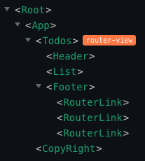

# TodoApp built with Vue and Vuex

The well-known TodoApp built with Vue and Vuex in a structured way.

## Concepts and tools covered

- [Vue CLI](https://cli.vuejs.org/)
- [Components and Props](https://vuejs.org/v2/guide/components.html#Passing-Data-to-Child-Components-with-Props)
- [Handling Events](https://vuejs.org/v2/guide/components.html#Listening-to-Child-Components-Events)
- [Vuex](https://vuex.vuejs.org/)
- [Unit Testing](https://vue-test-utils.vuejs.org/)
- [E2E Testing](https://www.cypress.io/)

## Component architecture

Application is compatible with [Vue devtools](https://chrome.google.com/webstore/detail/vuejs-devtools/nhdogjmejiglipccpnnnanhbledajbpd?hl=en)
